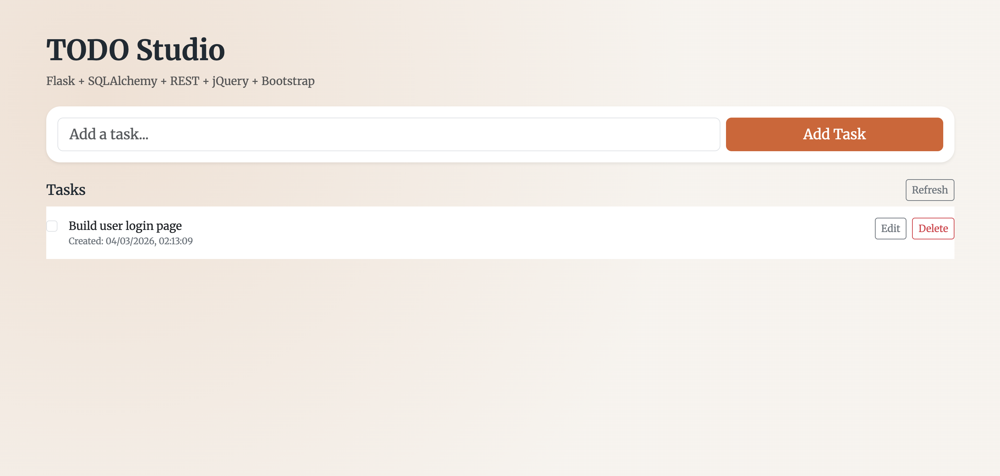

# Flask TODO App

A small full stack TODO application built to demonstrate practical usage of:

- `HTML`
- `CSS`
- `SCSS`
- `JavaScript`
- `jQuery`
- `Bootstrap 5`
- `Flask`
- `SQLAlchemy`
- `REST API`
- `SQLite`

This project is intentionally simple, but it shows the full request flow from browser UI to backend API to database.

## Features

- Create a new task
- View all tasks
- Mark a task as completed
- Edit a task title
- Delete a task
- Responsive UI with Bootstrap
- AJAX-based updates using jQuery without full page reloads

## Tech Stack

- `Flask` for the backend web server and routing
- `Flask-SQLAlchemy` for ORM and database access
- `SQLite` as the local database
- `jQuery` for DOM handling and AJAX requests
- `Bootstrap 5` for layout and ready-made UI components
- `SCSS` for maintainable styling
- `CSS` as the browser-ready compiled stylesheet

## Project Structure

```text
flask-app/
├── app.py
├── requirements.txt
├── README.md
├── instance/
│   └── todo.db
├── templates/
│   └── index.html
└── static/
    ├── css/
    │   ├── styles.scss
    │   └── styles.css
    └── js/
        └── app.js
```

## How It Works

1. The browser requests `/`.
2. `Flask` serves the main page from `templates/index.html`.
3. The page loads `Bootstrap`, `jQuery`, and the custom script `static/js/app.js`.
4. `jQuery` sends AJAX requests to the REST API endpoints under `/api/todos`.
5. `Flask` receives the request and uses `SQLAlchemy` to interact with the SQLite database.
6. The API returns JSON responses.
7. `jQuery` updates the UI dynamically without reloading the page.

## REST API Endpoints

### `GET /api/todos`

Returns all todo items as JSON.

### `POST /api/todos`

Creates a new todo item.

Example request body:

```json
{
  "title": "Build Flask API error handling"
}
```

### `PUT /api/todos/<id>`

Updates an existing todo item.

Example request body:

```json
{
  "title": "Update task title",
  "done": true
}
```

### `DELETE /api/todos/<id>`

Deletes a todo item.

## Database Model

The app uses a single `Todo` model with:

- `id` as primary key
- `title` as task text
- `done` as completion status
- `created_at` as timestamp

## Installation

1. Clone the repository:

```bash
git clone <your-repository-url>
cd flask-app
```

2. Create a virtual environment:

```bash
python -m venv .venv
```

3. Activate the virtual environment:

On macOS/Linux:

```bash
source .venv/bin/activate
```

On Windows:

```bash
.venv\Scripts\activate
```

4. Install dependencies:

```bash
pip install -r requirements.txt
```

5. Run the application:

```bash
python app.py
```

6. Open in your browser:

```text
http://127.0.0.1:5000
```

## Screenshot

```md

```

## Why This Project Is Useful

This app is a compact portfolio project because it demonstrates:

- Frontend structure with HTML and Bootstrap
- Custom styling with SCSS/CSS
- Client-side interaction with jQuery
- Backend routing with Flask
- CRUD operations with SQLAlchemy
- JSON-based communication through a REST API

## License

This project is open for learning and portfolio use.
